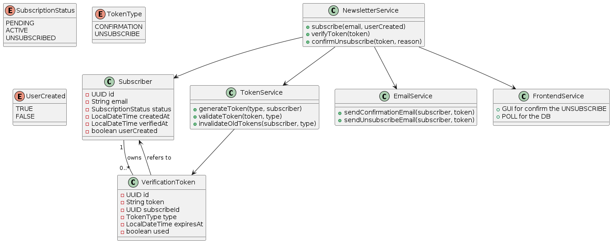

# Newsletter Service
This repository delivers a robust microservice built with **Spring Boot** for comprehensive newsletter subscription management. It allows seamless addition and removal of subscribers, dispatches confirmation emails, and generates personalized unsubscribe links for each newsletter. The service is architected to optimize subscriber management workflows and ensure adherence to industry-standard email compliance practices.

## Table of Contents

- [Newsletter Service](#newsletter-service)
  - [Table of Contents](#table-of-contents)
  - [Used Technologies](#used-technologies)
  - [Entities](#entities)
    - [Subscriber](#subscriber)
    - [VerificationToken](#verificationtoken)
    - [Classes](#classes)
  - [Repository Structure](#repository-structure)
    - [Folders structure](#folders-structure)
  - [Use case and flows](#use-case-and-flows)
  - [Endpoints](#endpoints)
  - [Security](#security)
  - [Configuration](#configuration)
  - [Docker Compose](#docker-compose)

## Used Technologies

- Java 21
- Spring Boot 3.5.6
    - Spring Web
    - Spring Data JPA
    - Spring Boot Starter Mail
    - Spring Security Starter
- PostgreSQL 15
- MailDev (development email server)
- Docker & Docker Compose

## Entities

This service defines two primary entities that represent the core data models within the system. These entities are structured to accurately capture and manage the key components involved in newsletter subscription processes.

### Subscriber

Represents an individual who is in the process.

| Parameter    | Type     | Description                                                      |
|:-------------|:---------|:-----------------------------------------------------------------|
| `id`         | UUID     | unique id                                                        |
| `email`      | String   | subscriber email                                                 |
| `status`     | Enum     | PENDING, ACTIVE, UNSUBSCRIBED                                    |
| `createdAt`  | Timestamp| subscrition date                                                 |
| `verifiedAt` | Timestamp| verification date                                                |
| `userCreated`| Boolean  | True: comes from a user account -> Don't sent confirmation email |

### VerificationToken

Represents a token.

| Parameter     | Type     | Description                                                      |
|:--------------|:---------|:-----------------------------------------------------------------|
| `id`          | UUID     | unique id                                                        |
| `token`       | String   | safety random token                                              |
| `subscribedId`| UUID     | Id from the Subscriber                                           |
| `type`        | Enum     | CONFIRMATION, UNSUBSCRIBE                                        |
| `createdAt`   | Timestamp| creation date                                                    |
| `expireAt`    | Timestamp| expiration date                                                  |
| `used`        | Boolean  | True: if the token was used                                      |


### Classes
Additionally, this repository contains service classes that encapsulate the business logic for each core functionality. Each service is designed with a clear separation of concerns, ensuring maintainability and scalability of the application.

- **Newsletter Service**
- **Token Service**
- **Email Service**
- **Frontend Service**



## Repository Structure

### Folders structure
```plaintext
newsletter-service/
├── src/
│   ├── main/
│   │   ├── java/com/raullopezpenalva/newsletter/
│   │   │   ├── config/
│   │   │   ├── controller/
│   │   │   │   └── NewsletterController.java
│   │   │   ├── model/
│   │   │   │   ├── Subscriber.java
│   │   │   │   ├── VerificationToken.java
│   │   │   │   ├── SubscriptionStatus.java
│   │   │   │   └── TokeType.java
│   │   │   ├── repository/
│   │   │   │   ├── SubscriberRepository.java
│   │   │   │   └── VerificationTokenRepository.java
│   │   │   ├── service/
│   │   │   │   ├── NewsletterService.java
│   │   │   │   ├── TokenService.java
│   │   │   │   └── EmailService.java
│   │   │   └── NewsletterServiceApplication.java
│   │   └── resources/
│   │       └── application.properties
│   └── test/java/com/raullopezpenalva/newsletter_service/
│       └── NewsletterServiceApplicationTests.java
├── target/                # maven output .jar
├── docker-compose.yml
├── Dockerfile
└── pom.xml
```


## Use case and flows

## Endpoints

## Security

## Configuration

## Docker Compose