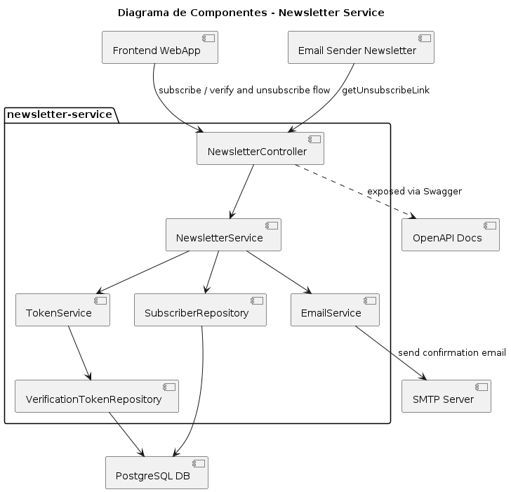
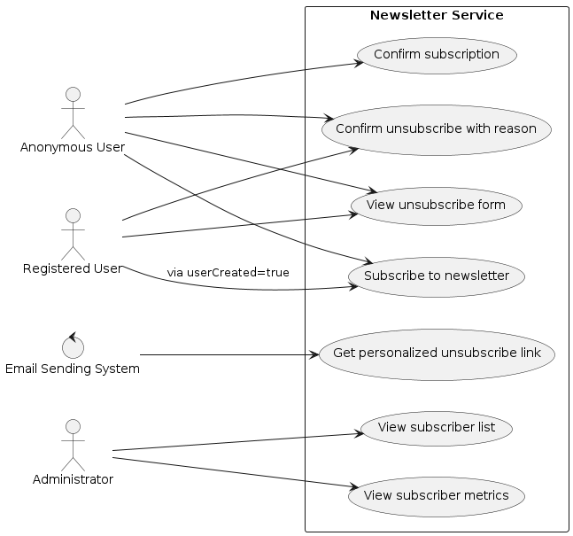
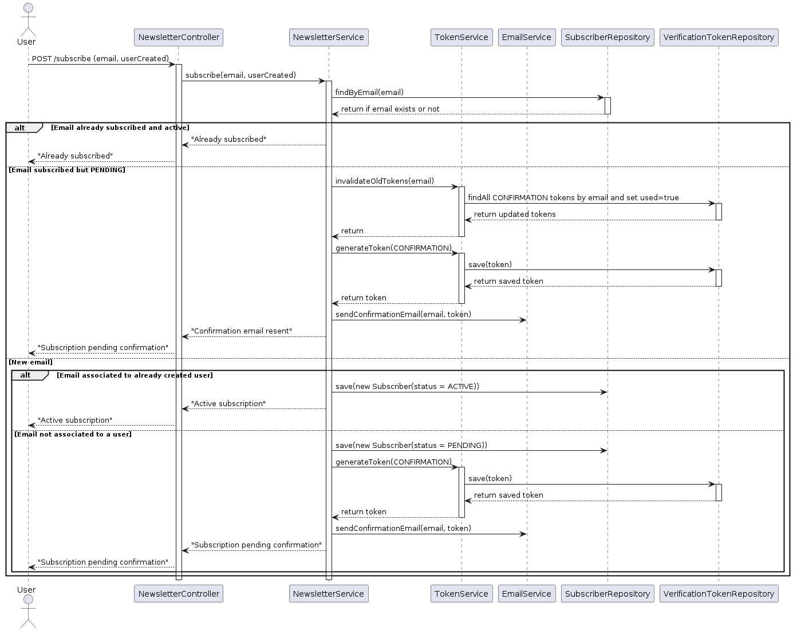
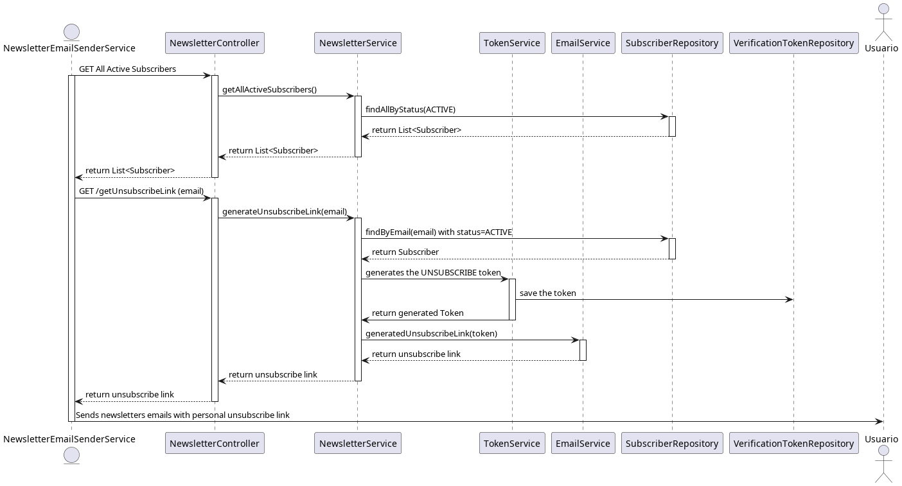
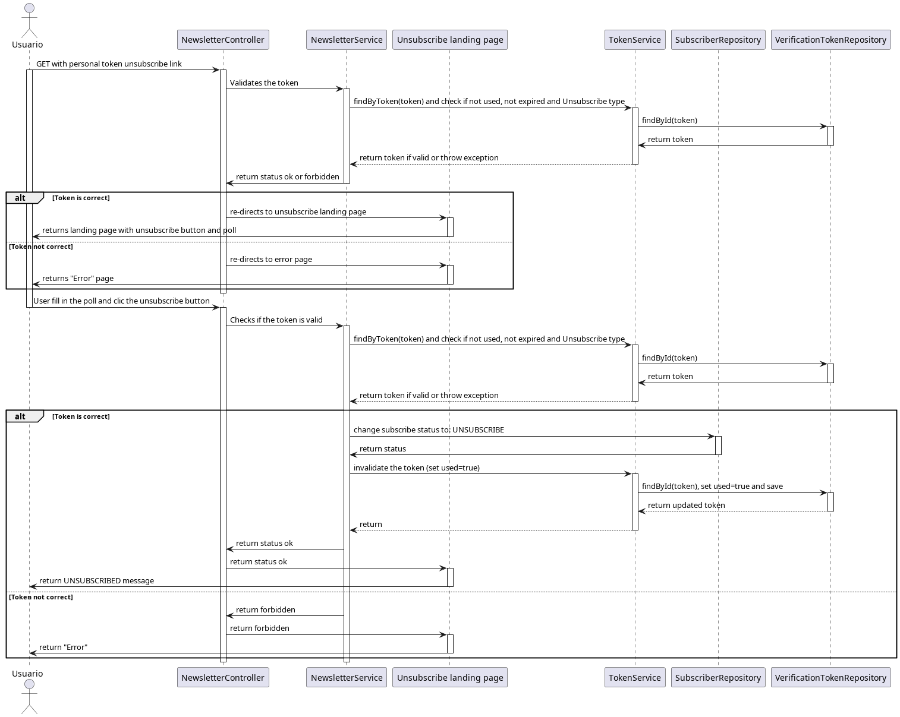

# Newsletter Service
This repository delivers a robust microservice built with **Spring Boot** for comprehensive newsletter subscription management. It allows seamless addition and removal of subscribers, dispatches confirmation emails, and generates personalized unsubscribe links for each newsletter. The service is architected to optimize subscriber management workflows and ensure adherence to industry-standard email compliance practices.

## Table of Contents

- [Newsletter Service](#newsletter-service)
  - [Table of Contents](#table-of-contents)
  - [Used Technologies](#used-technologies)
  - [Entities](#entities)
    - [Subscriber](#subscriber)
    - [VerificationToken](#verificationtoken)
    - [Classes](#classes)
  - [Repository Structure](#repository-structure)
    - [Folders structure](#folders-structure)
    - [Components](#components)
  - [Use case and flows](#use-case-and-flows)
    - [Subscription Flow](#subscription-flow)
    - [Unsubscribe Link Generation Flow](#unsubscribe-link-generation-flow)
    - [Unsubscribe Flow](#unsubscribe-flow)
  - [OpenAPI/Swagger](#openapiswagger)
  - [Security](#security)
  - [Configuration](#configuration)
    - [Environment variables](#environment-variables)
      - [Postgres DB:](#postgres-db)
      - [MailDev:](#maildev)
      - [Spring application.properties](#spring-applicationproperties)
  - [Docker Compose](#docker-compose)

## Used Technologies

- Java 21
- Spring Boot 3.5.6
    - Spring Web
    - Spring Data JPA
    - Spring Boot Starter Mail
    - Spring Security Starter
- PostgreSQL 15
- MailDev (development email server)
- Docker & Docker Compose

## Entities

This service defines two primary entities that represent the core data models within the system. These entities are structured to accurately capture and manage the key components involved in newsletter subscription processes.

### Subscriber

Represents an individual who is in the process.

| Parameter    | Type     | Description                                                      |
|:-------------|:---------|:-----------------------------------------------------------------|
| `id`         | UUID     | unique id                                                        |
| `email`      | String   | subscriber email                                                 |
| `status`     | Enum     | PENDING, ACTIVE, UNSUBSCRIBED                                    |
| `createdAt`  | Timestamp| subscrition date                                                 |
| `verifiedAt` | Timestamp| verification date                                                |
| `userCreated`| Boolean  | True: comes from a user account -> Don't sent confirmation email |

A subcriber has three states:

*

### VerificationToken

Represents a token.

| Parameter     | Type     | Description                                                      |
|:--------------|:---------|:-----------------------------------------------------------------|
| `id`          | UUID     | unique id                                                        |
| `token`       | String   | safety random token                                              |
| `subscribedId`| UUID     | Id from the Subscriber                                           |
| `type`        | Enum     | CONFIRMATION, UNSUBSCRIBE                                        |
| `createdAt`   | Timestamp| creation date                                                    |
| `expireAt`    | Timestamp| expiration date                                                  |
| `used`        | Boolean  | True: if the token was used                                      |


### Classes
Additionally, this repository contains service classes that encapsulate the business logic for each core functionality. Each service is designed with a clear separation of concerns, ensuring maintainability and scalability of the application.

- **Newsletter Service**
- **Token Service**
- **Email Service**
- **Frontend Service**


## Repository Structure

### Folders structure
```plaintext
newsletter-service/
├── src/
│   ├── main/
│   │   ├── java/com/raullopezpenalva/newsletter/
│   │   │   ├── config/
│   │   │   │   └── OpenApiConfig.java
│   │   │   ├── controller/
│   │   │   │   └── NewsletterController.java
│   │   │   ├── model/
│   │   │   │   ├── Subscriber.java
│   │   │   │   ├── VerificationToken.java
│   │   │   │   ├── SubscriptionStatus.java
│   │   │   │   └── TokeType.java
│   │   │   ├── repository/
│   │   │   │   ├── SubscriberRepository.java
│   │   │   │   └── VerificationTokenRepository.java
│   │   │   ├── service/
│   │   │   │   ├── NewsletterService.java
│   │   │   │   ├── TokenService.java
│   │   │   │   └── EmailService.java
│   │   │   └── NewsletterServiceApplication.java
│   │   └── resources/
│   │       └── application.properties
│   └── test/java/com/raullopezpenalva/newsletter_service/
│       └── NewsletterServiceApplicationTests.java
├── target/                # maven output .jar
├── docker-compose.yml
├── Dockerfile
└── pom.xml
```
### Components

The repository is organized into distinct components to promote a clear structure and ensure scalability of the service. This modular approach facilitates maintainability, enables easier feature expansion, and supports best practices in microservice architecture.



## Use case and flows

The use case are designed that the service defines 4 external entities that use the service. 

- **Annonimous subscriber**
   Is a person that only subscribes to the newsletter and not in ther others services that offers the company.
   This person has the next flows to use:
     - Subscribe to newsletter
     - Confirm subscription
     - View unsubscribe form
     - Confirm unsubcribe with reason

- **Registered User**
  Is a persona that subcribes from creating a user account in the company. This external entity don't need to confirm the subscription because is done by the user creation flow in other micro-service.
  This person has the next flows to use:
    - Subscribe to newsletter
    - Views unsubscribe form
    - Confirm unsubscribe with reason

- **Email Sending System**
  This the other micro-service that gets all the emails with active subscription and get the personal unsubscribe link for each email and send the newsletter emails with the personal unsubscribe link.
  This entity has the flows to use:
    - Get personalized unsubscribe link

- **Administrator**
  This is the administratos from the all system. It needs to enter and manage the micro-service.
  This entity has the flows to use:
    - View subscriber list
    - Views subscriber list



### Subscription Flow



### Unsubscribe Link Generation Flow



### Unsubscribe Flow



## OpenAPI/Swagger

This repository integrates API documentation using **springdoc-openapi-starter-webmvc-ui**, enabling comprehensive and interactive exploration of all available endpoints. The documentation is accessible via two primary methods:

- **Swagger UI**  
  Accessible at [http://localhost:8080/swagger-ui.html](http://localhost:8080/swagger-ui.html), this browser-based interface provides a user-friendly visualization of the API, allowing developers to review and test endpoints directly.

- **OpenAPI JSON Specification**  
  Available at [http://localhost:8080/v3/api-docs](http://localhost:8080/v3/api-docs), this endpoint serves the OpenAPI specification in JSON format. The specification can be imported into tools such as SwaggerHub or Postman for further analysis, testing, or integration.

All OpenAPI documentation configuration is centralized in the `OpenApiConfig.java` class within the `config` package, ensuring maintainability and consistency across the service.

## Security

## Configuration

### Environment variables

#### Postgres DB:
  - POSTGRES_USER: admin
  - POSTGRES_PASSWORD: admin
  - POSTGRES_DB: newsletter_db

#### MailDev:
  - WebUI: http://localhost:1080
  - SMTP: localhost:1025

#### Spring application.properties
```properties
# --- Application Properties ---
spring.application.name=Newsletter Service
server.port=8080

# --- PostgreSQL Database Configuration ---
spring.datasource.driver-class-name=org.postgresql.Driver
spring.datasource.url=jdbc:postgresql://newsletter_postgres:5432/newsletter_db
spring.datasource.username=admin
spring.datasource.password=admin
spring.jpa.hibernate.ddl-auto=update
spring.jpa.database-platform=org.hibernate.dialect.PostgreSQLDialect

# --- MailDev (for local testing) SMTP configuration ---
spring.mail.host=email_service
spring.mail.port=1025
spring.mail.username=no-reply@gmail.com
spring.mail.properties.mail.smtp.starttls.enable=false
spring.mail.properties.mail.smtp.starttls.required=false
spring.mail.properties.mail.smtp.auth=false
spring.mail.properties.mail.smtp.connectiontimeout=5000
spring.mail.properties.mail.smtp.timeout=5000
spring.mail.properties.mail.smtp.writetimeout=5000

# --- Security Configuration ---
spring.security.user.name=admin
spring.security.user.password=admin

# --- Frontend Base URL ---
app.frontendBaseUrl=http://localhost:8082/newsletter

# --- Debugging Configuration ---
logging.level.org.springframework.boot.autoconfigure.jdbc=DEBUG
logging.level.org.hibernate.SQL=DEBUG
logging.level.com.zaxxer.hikari=DEBUG
logging.level.org.springframework.boot.context.config=DEBUG
```

## Docker Compose