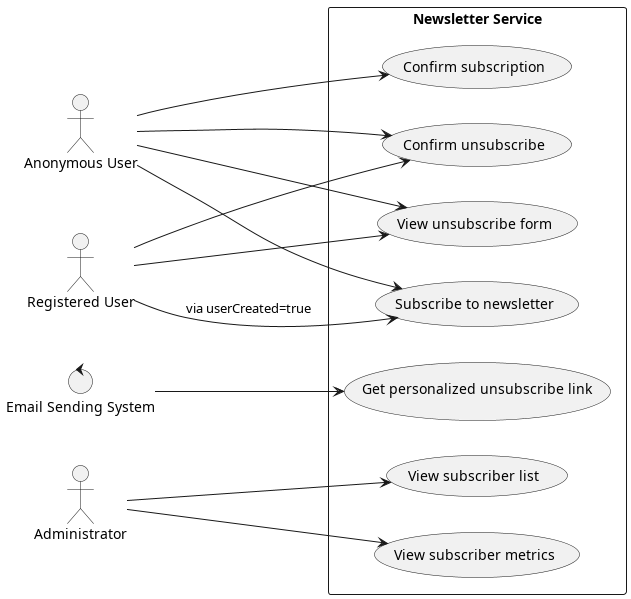
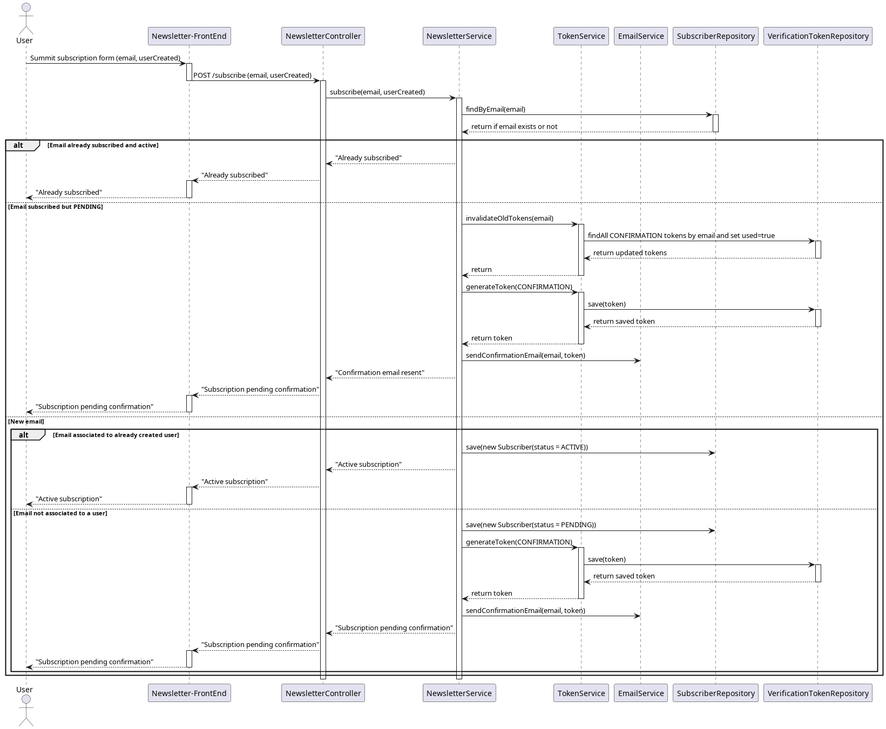
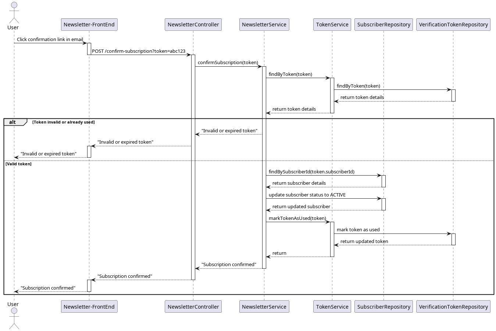
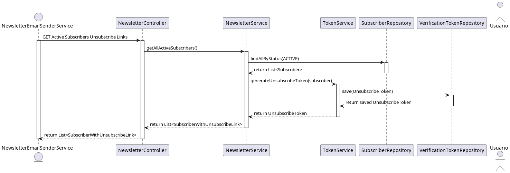
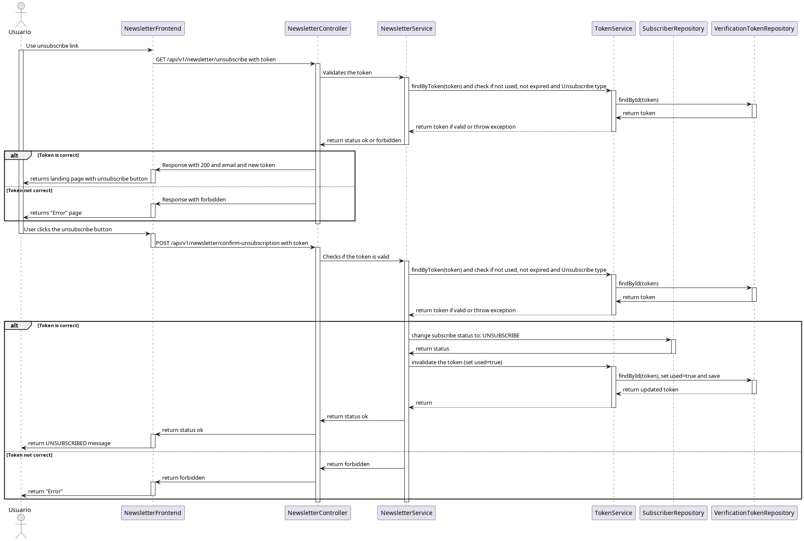

# Newsletter Service Flows

## Overview

This document describes the main business flows implemented by the `newsletter-service`.

The goal of these flows is to support the full newsletter lifecycle:

- subscription
- subscription confirmation
- unsubscribe link generation
- unsubscription
- unsubscription confirmation

These flows involve different actors and modules inside the system.

---

## Actors

The main actors involved in the system are:

### Anonymous Subscriber
A user who subscribes to the newsletter directly with an email address.

### Registered User
A user created through another system who may be subscribed automatically without needing email confirmation.

### Email Sending System
An external service that retrieves active subscribers and generates personalized unsubscribe links.

### Administrator
An internal actor who manages subscribers and reviews newsletter-related data.



---

# 1. Subscribe Flow

## Goal

Allow a user to subscribe to the newsletter.

## Main scenario

1. User sends a subscription request with an email address.
2. The newsletter module validates the request.
3. The service checks whether the subscriber already exists.
4. Depending on the result:
   - a new subscriber may be created
   - an existing subscriber may be reused
   - confirmation may still be pending
5. If confirmation is required, the newsletter module requests a confirmation token from the token module.
6. A confirmation event may be published.
7. The notification module sends a confirmation email.
8. The API returns a response DTO describing the result.

## Possible results

- `CREATED`
- `ALREADY_EXISTS`
- `CONFIRMATION_PENDING`

## Notes

- Anonymous subscribers usually require confirmation.
- Registered users may skip confirmation depending on business rules.



---

# 2. Confirmation Flow

## Goal

Allow a subscriber to confirm the subscription using a confirmation token.

## Main scenario

1. User clicks the confirmation link received by email.
2. The browser opens the frontend with the token in the URL.
3. The frontend calls the backend to validate the token.
4. The token module validates:
   - token exists
   - token is not expired
   - token has not been used
5. If valid, the newsletter module activates the subscriber.
6. The token is marked as used.
7. A success response is returned.

## Failure scenarios

- token not found
- token expired
- token already used
- subscriber not found



---

# 3. Generate Unsubscribe Links Flow

## Goal

Allow an external email sending system to retrieve unsubscribe links for all ACTIVE subscribers using a single request.

## Main scenario

1. The external email sending system calls:

```http
GET /api/v1/newsletter/generate-links
```

2. The newsletter module retrieves all subscribers with status ACTIVE.

3. For each active subscriber:

   - the token module generates or reuses an unsubscribe token

   - the service builds a personalized unsubscribe URL

4. The service returns a DTO response containing:

   - generation timestamp

   - total count

   - list of { email, unsubscribeUrl }

## Response structure

```JSON
{
  "generatedAt": "2026-03-05T10:00:00Z",
  "count": 2,
  "links": [
    {
      "email": "user1@example.com",
      "unsubscribeUrl": "https://<frontend-domain>/unsubscribe?token=<token>"
    }
  ]
}
```


## Notes

- Only ACTIVE subscribers are included.

- This flow replaced the previous N+1 request pattern.

---

# 4. Unsubscribe Flow
## Goal

Allow a subscriber to unsubscribe securely using a tokenized unsubscribe link.

## Main scenario

**Step 1 — Open unsubscribe page**

1. User clicks the unsubscribe link from the newsletter email.

2. Browser opens the frontend page:

```http
GET /unsubscribe?token=<token>
```

**Step 2 — Verify token**

3. The frontend extracts the token from the URL.

4. The frontend calls the backend:
```
GET /api/v1/newsletter/unsubscribe
```
with body: token

5. The backend validates:

   - token exists

   - token is not expired

   - token has not been used

   - subscriber exists

   - subscriber status is ACTIVE

6. If valid, the backend returns a DTO confirming the token can be used.

**Step 3 — Confirm unsubscription**

7. The frontend shows a confirmation UI.

8. The user clicks Confirm Unsubscribe.

9. The frontend calls the backend:
```
GET /api/v1/newsletter/confirm-unsubscription
```
with body: token and email

10. The backend validates the token again.

11. The newsletter module updates subscriber status:

`ACTIVE → UNSUBSCRIBED`

12. The token is invalidated / marked as used.

13. The service returns a success response.

14. The frontend displays a confirmation message.

**Failure scenarios**

 - invalid token

  - expired token

  - already used token

  - subscriber not found

  - subscriber already unsubscribed


---
# 5. Event-Driven Interactions

The service uses events to decouple business flows from secondary actions such as notifications.

## Example
**Subscription flow**

1. Newsletter module processes subscription.

2. Newsletter module publishes SubscriberSubscribedEvent.

3. Notification module listens to the event.

4. Notification module sends confirmation or welcome email.

**Unsubscribe flow**

1. Newsletter module confirms unsubscription.

2. Newsletter module publishes SubscriberUnsubscribedEvent.

3. Notification module may react if needed.

## Notes

Events are used for side effects and decoupling.

Immediate data needed inside a use case (for example token generation) is handled through direct service calls, not through events.

---
# 6. Common Error Scenarios

The following cases should be handled consistently across flows:

- invalid request payload

- invalid email format

- token not found

- token expired

- token already used

- subscriber not found

- subscriber already in target state

- unexpected internal error

All errors should return a consistent error response DTO.

---
# 7. Summary

The newsletter-service supports four core business flows:

1. Subscribe

2. Confirm subscription

3. Generate unsubscribe links

4. Unsubscribe

These flows are implemented using:

- modular architecture

- DTO-based API contracts

- reusable token management

- event-driven notifications