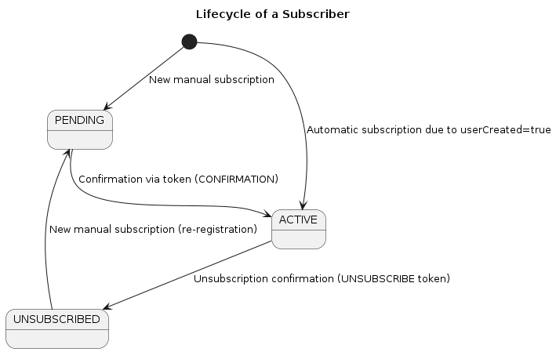

# Newsletter Service Domain

## Overview

This document defines the core domain model of the `newsletter-service`.

The domain is responsible for managing the lifecycle of newsletter subscribers, including:

- subscription
- email confirmation
- unsubscribe flow
- token-based verification

The design follows a Domain-Driven Design (DDD) approach, separating business logic from infrastructure and transport layers.

---

# Core Concepts

## Subscriber lifecycle

A subscriber goes through the following lifecycle:

1. Subscription requested
2. Confirmation pending
3. Subscription confirmed (ACTIVE)
4. Unsubscription requested
5. Unsubscription confirmed (UNSUBSCRIBED)

This lifecycle is enforced through domain rules and token validation.

---

# Entities

## Subscriber

Represents a user subscribed to the newsletter.

### Fields

| Parameter    | Type     | Description                                                      |
|:-------------|:---------|:-----------------------------------------------------------------|
| `id`         | UUID     | unique id                                                        |
| `email`      | String   | subscriber email                                                 |
| `status`     | Enum     | PENDING, ACTIVE, UNSUBSCRIBED                                    |
| `createdAt`  | Timestamp| subscrition date                                                 |
| `verifiedAt` | Timestamp| verification date                                                |
| `userCreated`| Boolean  | True: comes from a user account -> Don't sent confirmation email |
| `updatedAt`  | Timestamp| Last update date/time                                            |
| `adminNote`  | String   | Internal note for management                                     |
| `sourceIp`   | String   | Source IP of the request                                         |
| `userAgent`  | String   | Client User-Agent                                                |

### Status values

- `PENDING_CONFIRMATION`
- `ACTIVE`
- `UNSUBSCRIBED`

---

## VerificationToken

Represents a token used to validate actions such as:

- email confirmation
- unsubscribe confirmation

### Fields

| Parameter     | Type     | Description                                                      |
|:--------------|:---------|:-----------------------------------------------------------------|
| `id`          | UUID     | unique id                                                        |
| `token`       | String   | safety random token                                              |
| `subscribedId`| UUID     | Id from the Subscriber                                           |
| `type`        | Enum     | CONFIRMATION, UNSUBSCRIBE                                        |
| `createdAt`   | Timestamp| creation date                                                    |
| `expireAt`    | Timestamp| expiration date                                                  |
| `used`        | Boolean  | True: if the token was used                                      |

### Token types

- `CONFIRM_SUBSCRIPTION`
- `UNSUBSCRIBE`

---

# Value Objects

## Email (optional)

Represents a validated email address.

### Responsibilities

- format validation
- normalization (lowercase, trimming)

---

# Domain Rules

## Subscription rules

- A subscriber cannot exist twice with the same email
- If a subscription is requested:
  - If email does not exist → create subscriber with `PENDING_CONFIRMATION`
  - If email exists:
    - `ACTIVE` → return already subscribed
    - `PENDING_CONFIRMATION` → resend confirmation logic (optional)
    - `UNSUBSCRIBED` → reactivation flow (optional decision)

---

## Confirmation rules

- A confirmation token must:
  - exist
  - not be expired
  - not be used
  - be of type `CONFIRM_SUBSCRIPTION`

- If valid:
  - subscriber status becomes `ACTIVE`
  - token is marked as used

---

## Unsubscribe rules

- Only `ACTIVE` subscribers can unsubscribe
- Unsubscribe requires a valid token:
  - must exist
  - must not be expired
  - must not be used
  - must be of type `UNSUBSCRIBE`

- If valid:
  - subscriber status becomes `UNSUBSCRIBED`
  - token is marked as used

---

## Token rules

- Tokens are single-use
- Tokens have expiration time
- Tokens are linked to an email (not directly to subscriber ID)
- Tokens must be invalidated after successful use

---

# State Machine

## Subscriber State Transitions
`PENDING_CONFIRMATION` → `ACTIVE`

`ACTIVE` → `UNSUBSCRIBED`

`UNSUBSCRIBED` → (optional) `PENDING_CONFIRMATION`

### Notes

- Direct transitions must follow domain rules
- Invalid transitions must be rejected

---

# Invariants

These rules must always hold true:

- A subscriber email must be unique
- A token cannot be used more than once
- A token must not be valid after expiration
- A subscriber cannot be ACTIVE without prior confirmation
- An UNSUBSCRIBED user must not receive emails

---

# Domain Events (optional)

Future extension:

The system can emit domain events such as:

- `SubscriberCreated`
- `SubscriberConfirmed`
- `SubscriberUnsubscribed`
- `TokenGenerated`

These events can be used for:

- sending emails
- triggering notifications (e.g., Telegram, SMTP)
- analytics

---

# Notes

- Domain logic must not depend on controllers or frameworks
- Business rules should live in domain/services layer
- DTOs must not leak into domain layer